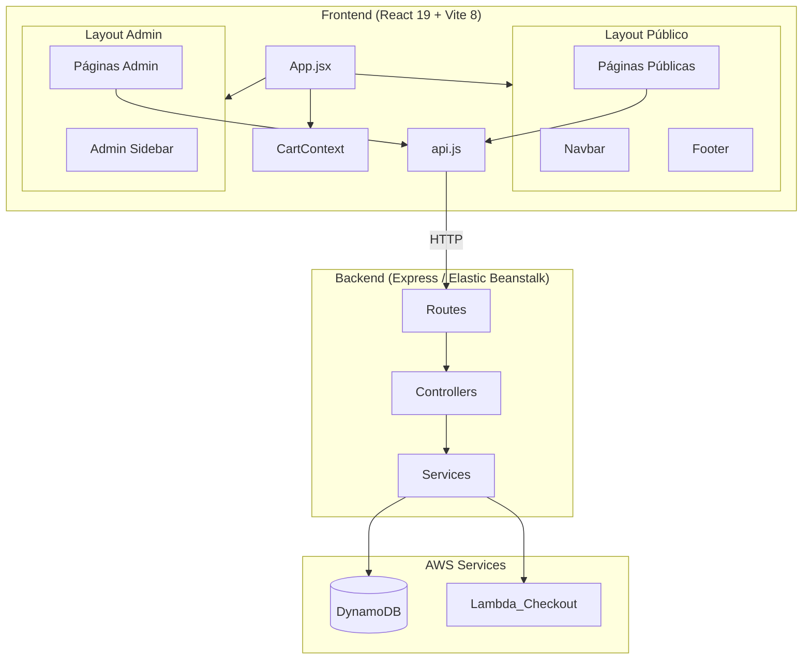
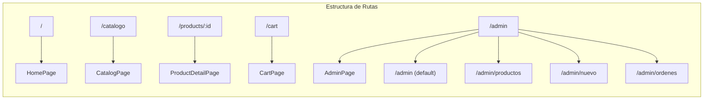
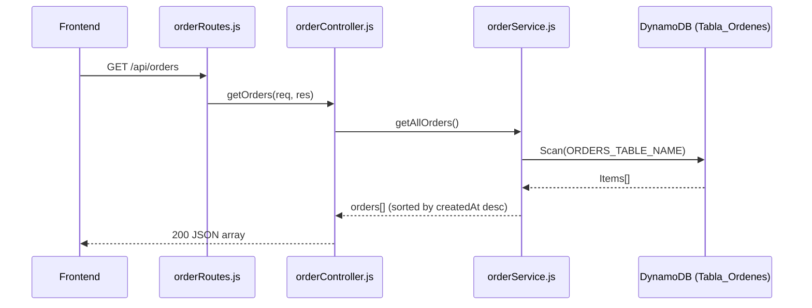
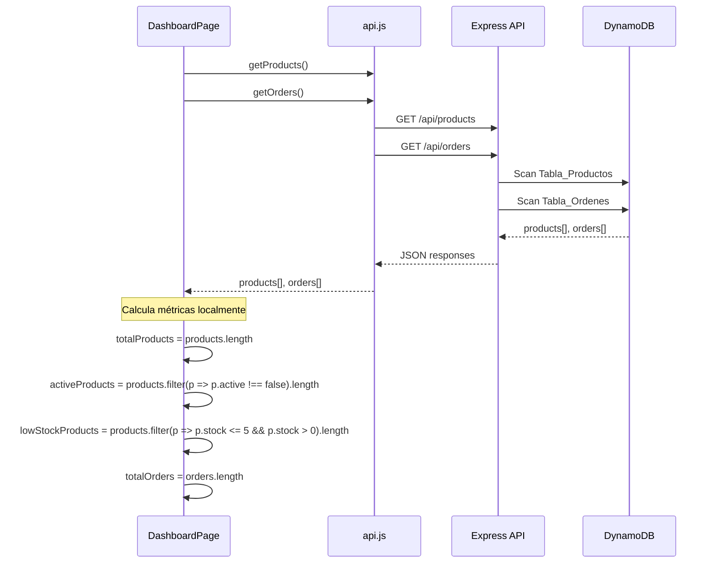
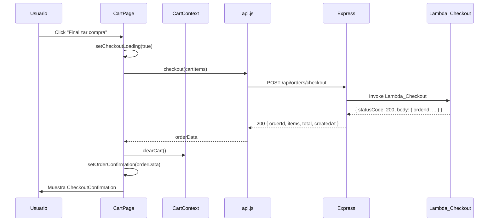

# Documento de Diseño — Rediseño Tu Tiendita

## Resumen General

Este documento describe el diseño técnico para transformar "Tu Tiendita" de un proyecto académico funcional a una tienda en línea con apariencia profesional y moderna. El rediseño abarca:

- **Layout global** con Navbar fija y Footer
- **Página de inicio** con Hero Section y productos destacados
- **Catálogo mejorado** con filtros, ordenamiento y tarjetas pulidas
- **Carrito optimizado** con confirmación de compra detallada
- **Panel de administración** con Dashboard de métricas, gestión de productos y consulta de órdenes
- **Endpoint GET /api/orders** en el backend para listar órdenes
- **Sistema de diseño visual** con CSS plano/modules, paleta consistente y componentes reutilizables

### Decisiones Clave de Diseño

| Decisión | Elección | Justificación |
|----------|----------|---------------|
| CSS Strategy | CSS plano (un archivo por componente) | Mantiene consistencia con el proyecto actual, sin agregar dependencias |
| State Management | CartContext existente | No se justifica agregar Redux/Zustand para esta escala |
| Routing | react-router-dom 7 existente | Ya instalado, soporta rutas anidadas para admin |
| Nuevo endpoint | GET /api/orders con Scan | Reutiliza infraestructura DynamoDB existente |
| Componentes de estado | LoadingSpinner, ErrorMessage, EmptyState reutilizables | Consistencia visual en toda la app |

---

## Arquitectura

### Diagrama de Arquitectura General



### Diagrama de Rutas



### Estructura de Carpetas (Frontend — cambios)

```
frontend/src/
├── components/
│   ├── layout/
│   │   ├── Layout.jsx          # Layout público (Navbar + Footer + children)
│   │   ├── Layout.css
│   │   ├── Navbar.jsx          # Navbar rediseñada (reemplaza actual)
│   │   ├── Navbar.css
│   │   ├── Footer.jsx          # Nuevo
│   │   └── Footer.css
│   ├── ui/
│   │   ├── LoadingSpinner.jsx  # Componente reutilizable de carga
│   │   ├── LoadingSpinner.css
│   │   ├── ErrorMessage.jsx    # Componente reutilizable de error
│   │   ├── ErrorMessage.css
│   │   ├── EmptyState.jsx      # Componente reutilizable de estado vacío
│   │   └── EmptyState.css
│   ├── home/
│   │   ├── HeroSection.jsx     # Nuevo
│   │   └── HeroSection.css
│   ├── catalog/
│   │   ├── ProductCard.jsx     # Rediseñado
│   │   ├── ProductCard.css
│   │   ├── CatalogFilters.jsx  # Nuevo
│   │   └── CatalogFilters.css
│   ├── cart/
│   │   ├── CartItem.jsx        # Rediseñado
│   │   ├── CartItem.css
│   │   ├── CartSummary.jsx     # Rediseñado
│   │   ├── CartSummary.css
│   │   ├── CheckoutConfirmation.jsx  # Nuevo
│   │   └── CheckoutConfirmation.css
│   ├── admin/
│   │   ├── AdminLayout.jsx     # Nuevo — layout con sidebar
│   │   ├── AdminLayout.css
│   │   ├── AdminSidebar.jsx    # Nuevo
│   │   ├── AdminSidebar.css
│   │   ├── DashboardCards.jsx  # Nuevo
│   │   ├── DashboardCards.css
│   │   ├── OrdersTable.jsx     # Nuevo
│   │   ├── OrdersTable.css
│   │   ├── OrderDetailModal.jsx # Nuevo
│   │   ├── OrderDetailModal.css
│   │   ├── ProductForm.jsx     # Mejorado (campos adicionales)
│   │   └── ProductForm.css
│   └── product/
│       └── (ProductDetailPage permanece en pages/)
├── pages/
│   ├── HomePage.jsx            # Rediseñada con Hero + productos destacados
│   ├── HomePage.css
│   ├── CatalogPage.jsx         # Nueva — catálogo completo con filtros
│   ├── CatalogPage.css
│   ├── ProductDetailPage.jsx   # Rediseñada
│   ├── ProductDetailPage.css
│   ├── CartPage.jsx            # Rediseñada
│   ├── CartPage.css
│   └── admin/
│       ├── DashboardPage.jsx   # Nueva
│       ├── DashboardPage.css
│       ├── ProductsPage.jsx    # Nueva (tabla de productos)
│       ├── ProductsPage.css
│       ├── NewProductPage.jsx  # Nueva
│       ├── NewProductPage.css
│       ├── OrdersPage.jsx      # Nueva
│       └── OrdersPage.css
├── services/
│   └── api.js                  # Extendido con getOrders()
├── context/
│   └── CartContext.jsx         # Sin cambios
├── App.jsx                     # Actualizado con nuevas rutas
├── App.css
├── index.css                   # Variables CSS globales y reset
└── main.jsx
```

---

## Componentes e Interfaces

### Componentes de Layout

#### Layout.jsx
```jsx
// Props: { children }
// Envuelve páginas públicas con Navbar fija + contenido + Footer
```

**Responsabilidades:**
- Renderizar Navbar en la parte superior (position: sticky)
- Renderizar el contenido principal (children) con min-height para empujar Footer
- Renderizar Footer en la parte inferior

#### Navbar.jsx (rediseñado)
```jsx
// Props: ninguna (usa useCart para badge)
// Estado interno: menuOpen (boolean) para hamburguesa mobile
```

**Interfaz visual:**
- Logo/nombre "Tu Tiendita" (enlace a /)
- Enlaces: Inicio, Catálogo, Carrito (con badge numérico)
- Menú hamburguesa en < 768px

#### Footer.jsx
```jsx
// Props: ninguna
// Componente estático
```

**Contenido:**
- Nombre de la tienda
- Texto "© 2025 Tu Tiendita. Todos los derechos reservados."
- Enlaces secundarios: Inicio, Catálogo, Contacto

### Componentes de UI Reutilizables

#### LoadingSpinner.jsx
```jsx
// Props: { message?: string }
// Default message: "Cargando..."
```

#### ErrorMessage.jsx
```jsx
// Props: { message: string, onRetry?: () => void }
// Muestra mensaje de error con botón "Reintentar" opcional
```

#### EmptyState.jsx
```jsx
// Props: { title: string, message: string, actionLabel?: string, actionTo?: string }
// Muestra ilustración SVG + mensaje + enlace opcional
```

### Componentes de Home

#### HeroSection.jsx
```jsx
// Props: ninguna
// Contenido estático con CTA hacia /catalogo
```

**Estructura:**
- Contenedor con fondo degradado o imagen
- Título de bienvenida
- Descripción breve
- Botón CTA "Ver Catálogo" → navega a /catalogo

### Componentes de Catálogo

#### ProductCard.jsx (rediseñado)
```jsx
// Props: { product: Product }
// Usa useCart() para addToCart
```

**Lógica de badges:**
- `stock === 0` → badge "Agotado", botón deshabilitado
- `stock > 0 && stock <= 5` → badge "Últimas unidades"
- `stock > 5` → sin badge

#### CatalogFilters.jsx
```jsx
// Props: { 
//   categories: string[],
//   selectedCategory: string | null,
//   sortBy: 'price-asc' | 'price-desc' | 'name-asc',
//   onCategoryChange: (category: string | null) => void,
//   onSortChange: (sort: string) => void
// }
```

### Componentes de Carrito

#### CartItem.jsx (rediseñado)
```jsx
// Props: { item: CartItem }
// Muestra: imagen, nombre, precio unitario, controles ±, subtotal, eliminar
```

#### CartSummary.jsx (rediseñado)
```jsx
// Props: ninguna (usa useCart)
// Muestra: subtotal, cantidad total de items, botón checkout
```

#### CheckoutConfirmation.jsx
```jsx
// Props: { order: OrderConfirmation }
// Muestra: orderId, fecha, lista de productos, total
```

**Interfaz OrderConfirmation:**
```js
{
  orderId: string,
  createdAt: string,       // ISO date
  items: Array<{ name: string, quantity: number, price: number }>,
  total: number
}
```

### Componentes de Admin

#### AdminLayout.jsx
```jsx
// Props: { children }
// Layout con sidebar de navegación + área de contenido
// NO usa el Layout público (Navbar/Footer)
```

#### AdminSidebar.jsx
```jsx
// Props: ninguna
// Enlaces internos: Dashboard, Productos, Nuevo Producto, Órdenes
// Usa NavLink para resaltar sección activa
```

#### DashboardCards.jsx
```jsx
// Props: { metrics: DashboardMetrics }
```

**Interfaz DashboardMetrics:**
```js
{
  totalProducts: number,
  activeProducts: number,
  lowStockProducts: number,  // stock <= 5
  totalOrders: number
}
```

#### OrdersTable.jsx
```jsx
// Props: { orders: Order[], onViewDetail: (order: Order) => void }
```

#### OrderDetailModal.jsx
```jsx
// Props: { order: Order | null, onClose: () => void }
// Modal con overlay que muestra items de la orden
```

---

## Modelos de Datos

### Modelos del Frontend

```js
// Producto (como viene del backend)
Product = {
  productId: string,       // UUID
  name: string,
  description: string,
  price: number,           // en MXN
  stock: number,           // entero >= 0
  imageUrl: string,
  category?: string,       // opcional, para filtros
  active?: boolean         // default true
}

// Item del carrito (en CartContext)
CartItem = {
  productId: string,
  name: string,
  price: number,
  quantity: number,
  imageUrl: string
}

// Orden (como viene de GET /api/orders)
Order = {
  orderId: string,
  createdAt: string,       // ISO 8601
  total: number,
  status: string,          // "completed", "pending", etc.
  itemCount: number,       // cantidad total de productos
  items: Array<{
    productId: string,
    name: string,
    quantity: number,
    price: number
  }>
}

// Métricas del Dashboard (calculadas en frontend)
DashboardMetrics = {
  totalProducts: number,
  activeProducts: number,
  lowStockProducts: number,
  totalOrders: number
}

// Datos del formulario de producto
ProductFormData = {
  name: string,
  description: string,
  price: number,
  stock: number,
  imageUrl: string,
  category: string,
  active: boolean
}
```

### Modelo del Backend (Tabla_Ordenes en DynamoDB)

```js
// Estructura existente en DynamoDB (creada por Lambda_Checkout)
OrderRecord = {
  orderId: string,         // Partition Key
  createdAt: string,       // ISO 8601 (Sort Key si aplica)
  items: Array<{
    productId: string,
    name: string,
    quantity: number,
    price: number
  }>,
  total: number,
  status: string           // "completed"
}
```

### Endpoint GET /api/orders — Diseño

**Ruta:** `GET /api/orders`  
**Controlador:** `orderController.getOrders`  
**Servicio:** `orderService.getAllOrders`

**Flujo:**


**Respuesta exitosa (200):**
```json
[
  {
    "orderId": "abc-123",
    "createdAt": "2025-01-15T10:30:00.000Z",
    "total": 459.50,
    "status": "completed",
    "itemCount": 3,
    "items": [
      { "productId": "p1", "name": "Producto A", "quantity": 2, "price": 150.00 },
      { "productId": "p2", "name": "Producto B", "quantity": 1, "price": 159.50 }
    ]
  }
]
```

**Respuesta de error (500):**
```json
{ "error": "Error al obtener las órdenes" }
```

**Implementación del servicio:**
```js
// orderService.js — nueva función
async function getAllOrders() {
  const { ScanCommand } = require('@aws-sdk/lib-dynamodb');
  const { docClient, ORDERS_TABLE_NAME } = require('../config/dynamodb');
  
  const result = await docClient.send(new ScanCommand({
    TableName: ORDERS_TABLE_NAME,
  }));
  
  const orders = (result.Items || [])
    .map(order => ({
      ...order,
      itemCount: order.items ? order.items.length : 0,
    }))
    .sort((a, b) => new Date(b.createdAt) - new Date(a.createdAt));
  
  return orders;
}
```

**Registro de ruta (sin modificar checkout):**
```js
// orderRoutes.js — agregar línea
router.get('/', orderController.getOrders);
```

---

### Flujo de Datos — Dashboard



### Flujo de Datos — Checkout con Confirmación



---

## Propiedades de Correctitud

*Una propiedad es una característica o comportamiento que debe mantenerse verdadero en todas las ejecuciones válidas de un sistema — esencialmente, una declaración formal sobre lo que el sistema debe hacer. Las propiedades sirven como puente entre especificaciones legibles por humanos y garantías de correctitud verificables por máquina.*

### Propiedad 1: Límite de productos destacados en HomePage

*Para cualquier* array de productos activos retornado por el backend, la HomePage SHALL mostrar como máximo 8 productos en la sección de destacados. Si hay N productos donde N > 8, solo se muestran 8; si N ≤ 8, se muestran todos.

**Valida: Requerimiento 2.2**

### Propiedad 2: ProductCard muestra todos los campos requeridos

*Para cualquier* producto válido (con name, price, stock, imageUrl y description definidos), el componente ProductCard SHALL renderizar todos estos campos en su salida: imagen, nombre, descripción (truncada), precio formateado en MXN, indicador de stock y botón de agregar al carrito.

**Valida: Requerimiento 3.1**

### Propiedad 3: Etiqueta de stock bajo en ProductCard

*Para cualquier* producto con stock en el rango [1, 5], el componente ProductCard SHALL mostrar la etiqueta "Últimas unidades". Para stock = 0 SHALL mostrar "Agotado". Para stock > 5 no SHALL mostrar ninguna etiqueta de advertencia.

**Valida: Requerimientos 3.2, 3.3**

### Propiedad 4: Filtro de categoría retorna solo productos coincidentes

*Para cualquier* lista de productos y cualquier categoría seleccionada, la función de filtrado SHALL retornar únicamente productos cuya categoría coincida exactamente con la categoría seleccionada. Si la categoría es null/vacía, SHALL retornar todos los productos.

**Valida: Requerimiento 3.5**

### Propiedad 5: Ordenamiento de productos es correcto

*Para cualquier* lista de productos, al aplicar ordenamiento por "precio ascendente" el resultado SHALL tener cada elemento con precio ≤ al siguiente; por "precio descendente" cada elemento con precio ≥ al siguiente; por "nombre" cada elemento con nombre ≤ lexicográficamente al siguiente.

**Valida: Requerimiento 3.6**

### Propiedad 6: Cálculo correcto del subtotal del carrito

*Para cualquier* conjunto de items en el carrito, el subtotal mostrado SHALL ser exactamente igual a la suma de (precio × cantidad) de cada item. La cantidad total de productos SHALL ser la suma de todas las cantidades.

**Valida: Requerimiento 4.2**

### Propiedad 7: Validación del formulario de productos

*Para cualquier* conjunto de datos de formulario, la función de validación SHALL rechazar datos donde: nombre esté vacío o sea solo whitespace, descripción esté vacía o sea solo whitespace, precio sea ≤ 0 o no numérico, stock sea negativo o no entero, imageUrl esté vacía o no tenga formato URL válido. SHALL aceptar datos que cumplan todas las condiciones.

**Valida: Requerimiento 5.2**

### Propiedad 8: Cálculo correcto de métricas del Dashboard

*Para cualquier* array de productos, las métricas del Dashboard SHALL cumplir: totalProducts = longitud del array, activeProducts = cantidad de productos con active !== false, lowStockProducts = cantidad de productos con stock > 0 AND stock ≤ 5.

**Valida: Requerimiento 6.2**

### Propiedad 9: Endpoint de órdenes retorna datos completos y ordenados

*Para cualquier* conjunto de órdenes en Tabla_Ordenes, el endpoint GET /api/orders SHALL retornar todas las órdenes, cada una con los campos orderId, createdAt, total, status e itemCount, ordenadas por createdAt de forma descendente (más reciente primero).

**Valida: Requerimientos 7.1, 7.2, 8.2**

### Propiedad 10: Tabla de órdenes renderiza todas las columnas

*Para cualquier* orden válida con todos sus campos, el componente OrdersTable SHALL renderizar las columnas: ID de orden, fecha formateada, total en MXN, estado, cantidad de productos y botón de ver detalle.

**Valida: Requerimiento 7.3**

---

## Manejo de Errores

### Estrategia General

| Capa | Tipo de Error | Manejo |
|------|---------------|--------|
| Frontend — API | Error de red (status 0) | ErrorMessage con "Error de conexión" + botón reintentar |
| Frontend — API | Error 400 (validación) | Mostrar mensaje específico del backend |
| Frontend — API | Error 500 (servidor) | ErrorMessage con "Error del servidor" + botón reintentar |
| Frontend — UI | Datos vacíos | EmptyState con mensaje contextual |
| Frontend — UI | Carga lenta | LoadingSpinner después de 0ms (inmediato) |
| Backend — DynamoDB | Error de Scan | Log del error + respuesta 500 con mensaje genérico |
| Backend — Lambda | Error de invocación | Log del error + respuesta 500 |

### Errores Específicos del Checkout

```js
// Flujo de manejo de errores en CartPage
try {
  const result = await checkout(cartItems);
  // Éxito: limpiar carrito, mostrar confirmación
  clearCart();
  setOrderConfirmation(result);
} catch (err) {
  if (err.status === 400 && err.data?.stockErrors) {
    // Error de stock: mostrar qué productos fallan
    setStockErrors(err.data.stockErrors);
  } else {
    // Error genérico: mensaje general
    setCheckoutError('Error al procesar la compra. Intenta de nuevo.');
  }
  // En ambos casos: NO limpiar el carrito
}
```

### Componentes de Estado Reutilizables

Los tres componentes de UI (`LoadingSpinner`, `ErrorMessage`, `EmptyState`) se usan consistentemente en:
- HomePage (carga de productos)
- CatalogPage (carga de productos)
- CartPage (estado vacío)
- DashboardPage (carga de métricas)
- OrdersPage (carga de órdenes)
- ProductDetailPage (carga de producto individual)

---

## Estrategia de Testing

### Enfoque Dual: Tests Unitarios + Tests de Propiedades

Este proyecto se beneficia de property-based testing (PBT) porque contiene lógica pura de transformación de datos (filtrado, ordenamiento, cálculo de métricas, validación de formularios) que varía significativamente con los inputs.

### Librería de PBT

- **Backend:** `fast-check` (ya instalado como devDependency)
- **Frontend:** Agregar `fast-check` como devDependency
- **Test runner:** `vitest` (ya configurado en backend, agregar en frontend)

### Configuración de Property Tests

- Mínimo **100 iteraciones** por propiedad
- Cada test referencia su propiedad del documento de diseño
- Formato de tag: `Feature: tu-tiendita-redesign, Property {N}: {texto}`

### Tests de Propiedades (PBT)

| Propiedad | Ubicación del Test | Qué genera |
|-----------|-------------------|------------|
| 1: Límite productos HomePage | frontend/src/pages/HomePage.test.js | Arrays de productos de longitud 0-50 |
| 2: ProductCard campos | frontend/src/components/catalog/ProductCard.test.js | Productos con campos aleatorios válidos |
| 3: Etiqueta stock | frontend/src/components/catalog/ProductCard.test.js | Productos con stock 0-100 |
| 4: Filtro categoría | frontend/src/pages/CatalogPage.test.js | Listas de productos con categorías aleatorias |
| 5: Ordenamiento | frontend/src/pages/CatalogPage.test.js | Listas de productos con precios/nombres aleatorios |
| 6: Subtotal carrito | frontend/src/context/CartContext.test.js | Items con precios y cantidades aleatorios |
| 7: Validación formulario | frontend/src/components/admin/ProductForm.test.js | Datos de formulario válidos e inválidos |
| 8: Métricas dashboard | frontend/src/pages/admin/DashboardPage.test.js | Arrays de productos con stock/active aleatorios |
| 9: Endpoint órdenes | backend/src/controllers/orderController.test.js | Órdenes con fechas aleatorias |
| 10: Tabla órdenes | frontend/src/components/admin/OrdersTable.test.js | Órdenes con campos aleatorios |

### Tests Unitarios (Ejemplos y Edge Cases)

| Componente/Función | Qué se testea |
|-------------------|---------------|
| Layout | Renderiza Navbar y Footer |
| Navbar | Badge muestra 0 cuando carrito vacío |
| Navbar | Menú hamburguesa toggle |
| HeroSection | CTA enlaza a /catalogo |
| CartPage | Estado vacío muestra enlace a catálogo |
| CartPage | Checkout exitoso muestra confirmación |
| CartPage | Error de stock muestra productos afectados |
| CartPage | Error de servidor muestra mensaje genérico |
| ProductForm | Vista previa de imagen con URL válida |
| ProductForm | Errores del servidor se muestran sin perder datos |
| OrderDetailModal | Muestra items de la orden |
| GET /api/orders | Error de DynamoDB retorna 500 |
| GET /api/orders | Tabla vacía retorna array vacío |

### Tests de Integración

| Test | Qué verifica |
|------|-------------|
| Backend: GET /api/orders | Endpoint responde correctamente con DynamoDB mockeado |
| Backend: POST /api/orders/checkout | Endpoint existente sigue funcionando |
| Frontend: Build | `vite build` produce archivos estáticos válidos |

### Estructura de Tests

```
frontend/
├── src/
│   ├── components/
│   │   ├── catalog/
│   │   │   └── ProductCard.test.js
│   │   ├── admin/
│   │   │   ├── ProductForm.test.js
│   │   │   └── OrdersTable.test.js
│   │   └── ui/
│   │       └── (tests de componentes reutilizables)
│   ├── pages/
│   │   ├── HomePage.test.js
│   │   ├── CatalogPage.test.js
│   │   └── admin/
│   │       └── DashboardPage.test.js
│   └── context/
│       └── CartContext.test.js

backend/
├── src/
│   ├── controllers/
│   │   └── orderController.test.js
│   └── services/
│       └── orderService.test.js
```
