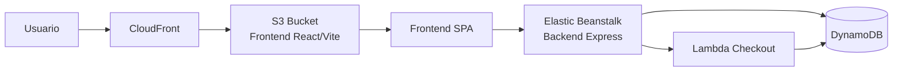
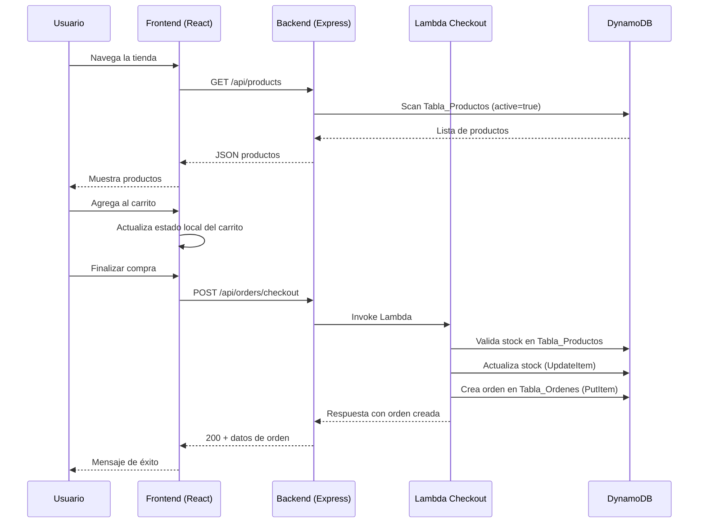
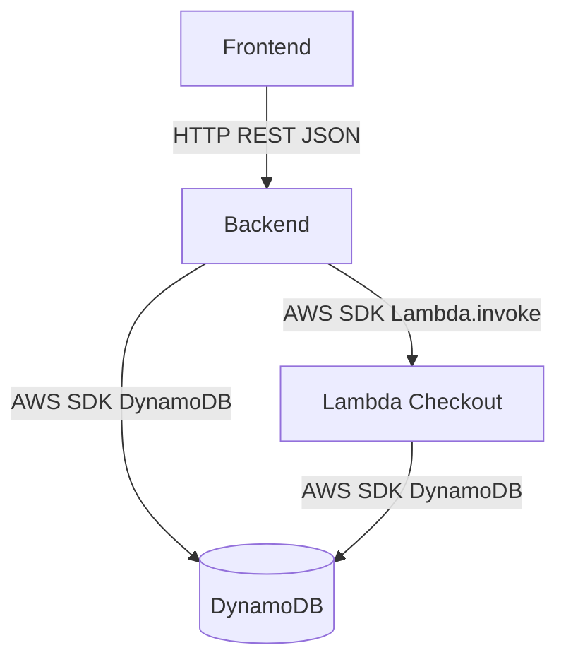
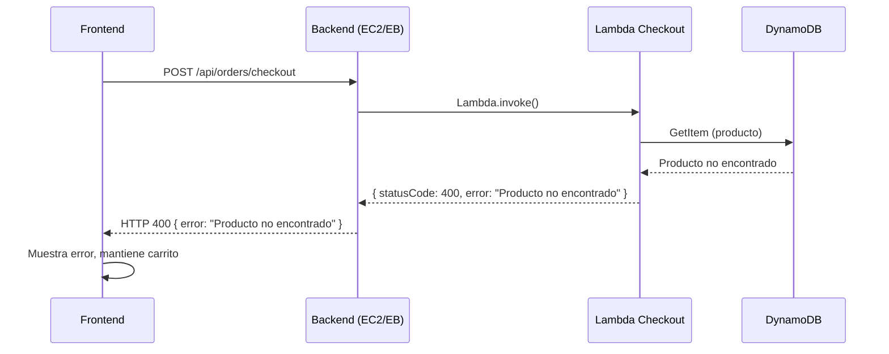

# Documento de Diseño — Tu Tiendita

## Resumen

Tu Tiendita es un proyecto académico que demuestra una arquitectura AWS completa mediante una tienda virtual simple. La aplicación se compone de cuatro componentes principales: un Frontend React/Vite servido desde S3 vía CloudFront, un Backend Node.js/Express en Elastic Beanstalk, una función Lambda para procesamiento de checkout, y DynamoDB como base de datos. El diseño prioriza la simplicidad y claridad arquitectónica sobre la complejidad de un e-commerce real.

## Arquitectura

### Diagrama de Arquitectura



### Flujo de Datos



### Decisiones de Arquitectura

1. **Carrito en estado local del Frontend**: El carrito se gestiona enteramente en el estado de React (useState/useContext). No se persiste en backend ni en localStorage. Esto simplifica la arquitectura y es suficiente para un proyecto académico.

2. **Soft delete para productos**: La eliminación de productos usa soft delete (campo `active: false`) en lugar de borrado físico. Esto preserva la integridad referencial con órdenes existentes.

3. **Lambda separada para checkout**: El procesamiento de compra se delega a una Lambda para demostrar la integración con este servicio AWS, aunque podría hacerse directamente en el Backend.

4. **Sin autenticación**: No se implementa autenticación. El panel de administración es accesible por ruta directa. Esto es aceptable para un proyecto académico.

5. **CSS simple sin frameworks**: Se usa CSS vanilla o módulos CSS para mantener la simplicidad y evitar dependencias innecesarias.

## Componentes e Interfaces

### Frontend (React + Vite)

#### Estructura de Carpetas
```
frontend/
├── public/
├── src/
│   ├── components/
│   │   ├── ProductCard.jsx
│   │   ├── CartItem.jsx
│   │   ├── CartSummary.jsx
│   │   ├── ProductForm.jsx
│   │   └── Navbar.jsx
│   ├── pages/
│   │   ├── HomePage.jsx
│   │   ├── ProductDetailPage.jsx
│   │   ├── CartPage.jsx
│   │   └── AdminPage.jsx
│   ├── services/
│   │   └── api.js
│   ├── context/
│   │   └── CartContext.jsx
│   ├── App.jsx
│   └── main.jsx
├── .env.example
├── package.json
└── vite.config.js
```

#### Componentes Principales

| Componente | Responsabilidad |
|---|---|
| `HomePage` | Lista de productos activos con botón "Agregar al carrito" |
| `ProductDetailPage` | Detalle completo de un producto |
| `CartPage` | Vista del carrito con controles de cantidad, total y botón "Finalizar compra" |
| `AdminPage` | Panel CRUD de productos |
| `ProductCard` | Tarjeta individual de producto |
| `CartItem` | Fila de producto en el carrito con controles +/- y eliminar |
| `CartSummary` | Resumen del total del carrito |
| `ProductForm` | Formulario para crear/editar productos |
| `Navbar` | Navegación principal con enlace al carrito |
| `CartContext` | Context de React para estado global del carrito |

#### Servicio API (`services/api.js`)

```javascript
// Funciones exportadas
getProducts()              // GET /api/products
getProductById(id)         // GET /api/products/:id
createProduct(data)        // POST /api/products
updateProduct(id, data)    // PUT /api/products/:id
deleteProduct(id)          // DELETE /api/products/:id
checkout(cartItems)        // POST /api/orders/checkout
```

### Backend (Node.js + Express)

#### Estructura de Carpetas
```
backend/
├── src/
│   ├── routes/
│   │   ├── productRoutes.js
│   │   ├── orderRoutes.js
│   │   └── healthRoutes.js
│   ├── controllers/
│   │   ├── productController.js
│   │   ├── orderController.js
│   │   └── healthController.js
│   ├── services/
│   │   ├── productService.js
│   │   ├── orderService.js
│   │   └── lambdaService.js
│   ├── config/
│   │   ├── dynamodb.js
│   │   └── env.js
│   └── app.js
├── seed/
│   └── seedProducts.js
├── .env.example
├── package.json
└── server.js
```

#### Endpoints API

| Método | Ruta | Controlador | Descripción |
|---|---|---|---|
| GET | `/health` | `healthController` | Verificación de salud |
| GET | `/api/products` | `productController.getAll` | Lista productos activos |
| GET | `/api/products/:id` | `productController.getById` | Detalle de producto |
| POST | `/api/products` | `productController.create` | Crear producto |
| PUT | `/api/products/:id` | `productController.update` | Actualizar producto |
| DELETE | `/api/products/:id` | `productController.delete` | Desactivar producto (soft delete) |
| POST | `/api/orders/checkout` | `orderController.checkout` | Procesar compra simulada |

#### Capa de Servicios

- **productService.js**: Interactúa con DynamoDB para operaciones CRUD de productos. Usa `DynamoDBDocumentClient` del AWS SDK v3.
- **orderService.js**: Invoca la Lambda de checkout mediante `LambdaClient` del AWS SDK v3.
- **lambdaService.js**: Encapsula la invocación de la función Lambda.

### Lambda Checkout (Node.js)

#### Estructura de Carpetas
```
lambda/
└── checkout/
    ├── index.js
    └── package.json
```

#### Flujo de Procesamiento

1. Recibe payload con array de items `[{ productId, quantity }]`
2. Para cada item, consulta el producto en `Tabla_Productos`
3. Valida existencia del producto
4. Valida stock suficiente (`stock >= quantity`)
5. Si todo es válido: reduce stock y crea orden en `Tabla_Ordenes`
6. Retorna la orden creada o error descriptivo

### Interfaces entre Componentes



- **Frontend ↔ Backend**: HTTP REST con JSON. CORS habilitado.
- **Backend → Lambda**: Invocación síncrona vía AWS SDK (`InvokeCommand`).
- **Backend → DynamoDB**: AWS SDK v3 (`DynamoDBDocumentClient`).
- **Lambda → DynamoDB**: AWS SDK v3 (`DynamoDBDocumentClient`).

## Modelos de Datos

### Tabla_Productos (DynamoDB)

| Campo | Tipo | Descripción |
|---|---|---|
| `productId` | String (PK) | UUID generado al crear el producto |
| `name` | String | Nombre del producto |
| `description` | String | Descripción del producto |
| `price` | Number | Precio del producto |
| `stock` | Number | Cantidad disponible en inventario |
| `imageUrl` | String | URL de la imagen del producto |
| `active` | Boolean | Indica si el producto está activo (visible) |
| `createdAt` | String (ISO 8601) | Fecha de creación |
| `updatedAt` | String (ISO 8601) | Fecha de última actualización |

**Clave primaria**: `productId` (Partition Key)

### Tabla_Ordenes (DynamoDB)

| Campo | Tipo | Descripción |
|---|---|---|
| `orderId` | String (PK) | UUID generado al crear la orden |
| `items` | List | Array de objetos `{ productId, name, quantity, price }` |
| `total` | Number | Total calculado de la orden |
| `status` | String | Estado de la orden ("completed") |
| `createdAt` | String (ISO 8601) | Fecha de creación |

**Clave primaria**: `orderId` (Partition Key)

### Modelo del Carrito (Estado Frontend)

```javascript
// CartContext state
{
  items: [
    {
      productId: String,
      name: String,
      price: Number,
      quantity: Number,
      imageUrl: String
    }
  ]
}
```

### Payloads de API

#### POST /api/orders/checkout — Request
```json
{
  "items": [
    { "productId": "uuid-1", "quantity": 2 },
    { "productId": "uuid-2", "quantity": 1 }
  ]
}
```

#### POST /api/orders/checkout — Response (éxito)
```json
{
  "orderId": "uuid-order",
  "items": [
    { "productId": "uuid-1", "name": "Producto A", "quantity": 2, "price": 10.00 }
  ],
  "total": 20.00,
  "status": "completed",
  "createdAt": "2024-01-01T00:00:00.000Z"
}
```

#### POST /api/products — Request
```json
{
  "name": "Producto Nuevo",
  "description": "Descripción del producto",
  "price": 25.50,
  "stock": 100,
  "imageUrl": "https://example.com/image.jpg"
}
```

#### Validación de Producto (Backend)

| Campo | Regla |
|---|---|
| `name` | Requerido, string no vacío |
| `description` | Requerido, string no vacío |
| `price` | Requerido, número > 0 |
| `stock` | Requerido, entero >= 0 |
| `imageUrl` | Requerido, string no vacío |

## Propiedades de Correctitud

*Una propiedad es una característica o comportamiento que debe cumplirse en todas las ejecuciones válidas de un sistema — esencialmente, una declaración formal sobre lo que el sistema debe hacer. Las propiedades sirven como puente entre especificaciones legibles por humanos y garantías de correctitud verificables por máquina.*

### Propiedad 1: Filtrado de productos activos

*Para cualquier* conjunto de productos en la Tabla_Productos con estados `active` mixtos (true/false), la función de consulta de productos SHALL retornar únicamente los productos con `active=true`, y ningún producto activo debe ser omitido.

**Valida: Requisitos 1.2**

### Propiedad 2: Completitud de renderizado de producto

*Para cualquier* producto válido con todos sus campos (name, description, price, stock, imageUrl), el componente de renderizado SHALL producir una salida que contenga cada uno de esos campos.

**Valida: Requisitos 1.3**

### Propiedad 3: Round-trip de creación y consulta de producto

*Para cualquier* datos de producto válidos, crear un producto y luego consultarlo por su productId SHALL retornar un producto con los mismos datos proporcionados, con `active=true` y con fechas `createdAt` y `updatedAt` establecidas.

**Valida: Requisitos 2.2, 5.3**

### Propiedad 4: Agregar producto al carrito establece cantidad en 1

*Para cualquier* producto que no esté en el carrito, al agregarlo, el carrito SHALL contener ese producto con cantidad exactamente igual a 1, y los demás items del carrito SHALL permanecer sin cambios.

**Valida: Requisitos 3.1**

### Propiedad 5: Incrementar y decrementar cantidad ajusta en exactamente 1

*Para cualquier* producto en el carrito con cantidad `q`, incrementar SHALL resultar en cantidad `q + 1`, y decrementar (cuando `q > 1`) SHALL resultar en cantidad `q - 1`. Los demás items del carrito SHALL permanecer sin cambios.

**Valida: Requisitos 3.2, 3.3**

### Propiedad 6: Eliminar producto del carrito preserva los demás items

*Para cualquier* carrito con múltiples productos, al eliminar un producto específico, ese producto SHALL no estar presente en el carrito resultante, y todos los demás productos SHALL permanecer con sus cantidades originales.

**Valida: Requisitos 3.5**

### Propiedad 7: Total del carrito es la suma de precio por cantidad

*Para cualquier* carrito con cualquier combinación de productos y cantidades, el total calculado SHALL ser igual a la suma de `(precio × cantidad)` para cada item del carrito.

**Valida: Requisitos 3.6**

### Propiedad 8: Lambda valida existencia y stock de productos

*Para cualquier* orden con items, si algún productId no existe en la Tabla_Productos o si la cantidad solicitada excede el stock disponible, la Lambda_Checkout SHALL rechazar la orden con un error descriptivo.

**Valida: Requisitos 4.3, 4.4**

### Propiedad 9: Checkout exitoso actualiza stock y crea orden correcta

*Para cualquier* orden válida (todos los productos existen y tienen stock suficiente), después del procesamiento: (a) el stock de cada producto SHALL haberse reducido exactamente por la cantidad ordenada, y (b) la orden creada en Tabla_Ordenes SHALL tener un orderId único, los items correctos, un total igual a la suma de `(precio × cantidad)`, status "completed" y una fecha `createdAt` válida.

**Valida: Requisitos 4.5, 4.6**

### Propiedad 10: Actualización de producto refleja nuevos datos

*Para cualquier* producto existente y datos de actualización válidos, después de aplicar la actualización, el producto SHALL reflejar los nuevos datos proporcionados y el campo `updatedAt` SHALL ser posterior al valor anterior.

**Valida: Requisitos 5.6**

### Propiedad 11: Soft delete establece active en false

*Para cualquier* producto activo, al ejecutar la operación de eliminación (DELETE), el producto SHALL tener el campo `active` establecido en `false` en la Tabla_Productos.

**Valida: Requisitos 5.8**

### Propiedad 12: Datos inválidos de producto son rechazados

*Para cualquier* datos de producto inválidos (nombre vacío, precio negativo o cero, stock negativo, campos faltantes), la operación de creación o actualización SHALL retornar un error HTTP 400 y no SHALL modificar la Tabla_Productos.

**Valida: Requisitos 5.9**

## Manejo de Errores

### Estrategia General

El proyecto utiliza una estrategia de manejo de errores por capas, donde cada componente maneja sus errores y los propaga de forma descriptiva al componente que lo invocó.

### Backend (Express)

| Escenario | Código HTTP | Respuesta |
|---|---|---|
| Producto no encontrado | 404 | `{ "error": "Producto no encontrado" }` |
| Datos de producto inválidos | 400 | `{ "error": "Datos inválidos", "details": [...] }` |
| Error de DynamoDB | 500 | `{ "error": "Error interno del servidor" }` |
| Error al invocar Lambda | 500 | `{ "error": "Error al procesar la orden" }` |
| Ruta no encontrada | 404 | `{ "error": "Ruta no encontrada" }` |

**Implementación:**
- Middleware de manejo de errores centralizado en Express que captura excepciones no manejadas.
- Cada controlador usa bloques try/catch y delega al middleware de errores.
- Los errores de validación se detectan antes de interactuar con DynamoDB.
- Los errores de DynamoDB se capturan en la capa de servicios y se transforman en respuestas HTTP apropiadas.

### Lambda Checkout

| Escenario | Respuesta |
|---|---|
| Producto no encontrado | `{ "statusCode": 400, "body": { "error": "Producto no encontrado: {productId}" } }` |
| Stock insuficiente | `{ "statusCode": 400, "body": { "error": "Stock insuficiente para: {productName}" } }` |
| Payload inválido (items vacío o ausente) | `{ "statusCode": 400, "body": { "error": "El carrito no puede estar vacío" } }` |
| Error de DynamoDB | `{ "statusCode": 500, "body": { "error": "Error interno al procesar la orden" } }` |

**Implementación:**
- La Lambda valida el payload al inicio del handler.
- Las validaciones de existencia y stock se ejecutan antes de cualquier escritura.
- Si alguna validación falla, se retorna inmediatamente sin modificar datos.
- Los errores de DynamoDB se capturan con try/catch y se retornan con código 500.

### Frontend (React)

| Escenario | Comportamiento |
|---|---|
| Error de red (backend no disponible) | Muestra mensaje de error al usuario |
| Error 400 del backend | Muestra el mensaje de error específico del backend |
| Error 404 del backend | Muestra mensaje "Producto no encontrado" |
| Error 500 del backend | Muestra mensaje genérico de error del servidor |
| Checkout fallido | Muestra el error y mantiene el carrito intacto |

**Implementación:**
- El servicio API (`services/api.js`) centraliza el manejo de errores HTTP.
- Los componentes muestran mensajes de error en la UI usando estado local.
- En caso de error en checkout, el carrito NO se vacía para que el usuario pueda reintentar.

### Flujo de Errores entre Componentes



## Estrategia de Testing

### Enfoque Dual

El proyecto utiliza un enfoque dual de testing:

1. **Tests unitarios (example-based)**: Verifican escenarios específicos, casos borde y condiciones de error con ejemplos concretos.
2. **Tests basados en propiedades (property-based)**: Verifican propiedades universales que deben cumplirse para todas las entradas válidas, usando generación aleatoria de datos.

Ambos enfoques son complementarios: los tests unitarios capturan bugs concretos y los tests de propiedades verifican correctitud general.

### Librería de Property-Based Testing

- **Backend y Lambda**: [fast-check](https://github.com/dubzzz/fast-check) para Node.js
- **Frontend**: [fast-check](https://github.com/dubzzz/fast-check) con React Testing Library
- **Test runner**: Vitest (compatible con el ecosistema Vite del frontend y configurable para backend)

### Configuración de Tests de Propiedades

- Mínimo **100 iteraciones** por test de propiedad
- Cada test de propiedad debe referenciar su propiedad del documento de diseño
- Formato de tag: **Feature: tu-tiendita, Property {número}: {texto de la propiedad}**

### Distribución de Tests

#### Backend (Node.js/Express en EC2 vía Elastic Beanstalk)

| Tipo | Qué se prueba | Propiedades |
|---|---|---|
| Property | Filtrado de productos activos | Propiedad 1 |
| Property | Round-trip crear/consultar producto | Propiedad 3 |
| Property | Actualización de producto | Propiedad 10 |
| Property | Soft delete de producto | Propiedad 11 |
| Property | Rechazo de datos inválidos | Propiedad 12 |
| Unit | Endpoint GET /health retorna 200 | Req 6.1 |
| Unit | Producto no encontrado retorna 404 | Req 2.3 |
| Unit | Error de DynamoDB retorna 500 | Req 1.5 |
| Unit | Error de Lambda retorna 500 | Req 4.11 |
| Smoke | CORS habilitado con métodos correctos | Req 7.1, 7.2 |
| Smoke | Variables de entorno leídas correctamente | Req 8.1, 8.2, 8.3 |

#### Lambda Checkout

| Tipo | Qué se prueba | Propiedades |
|---|---|---|
| Property | Validación de existencia y stock | Propiedad 8 |
| Property | Checkout exitoso actualiza stock y crea orden | Propiedad 9 |
| Unit | Payload vacío retorna error | Req 4.9 |
| Unit | Producto no encontrado retorna error | Req 4.9 |
| Unit | Stock insuficiente retorna error | Req 4.10 |

#### Frontend (React)

| Tipo | Qué se prueba | Propiedades |
|---|---|---|
| Property | Renderizado completo de producto | Propiedad 2 |
| Property | Agregar producto al carrito | Propiedad 4 |
| Property | Incrementar/decrementar cantidad | Propiedad 5 |
| Property | Eliminar producto del carrito | Propiedad 6 |
| Property | Cálculo del total del carrito | Propiedad 7 |
| Unit | Botón "Finalizar compra" deshabilitado con carrito vacío | Req 3.8 |
| Unit | Cantidad llega a 0 elimina producto | Req 3.4 |
| Unit | Checkout exitoso vacía carrito y muestra mensaje | Req 4.8 |

### Mocking

- **DynamoDB**: Se mockea con objetos en memoria para tests unitarios y de propiedades del backend y Lambda. Esto permite ejecutar 100+ iteraciones sin costo ni latencia.
- **Lambda invocation**: Se mockea en tests del backend para aislar la lógica del controlador de órdenes.
- **API calls**: Se mockean en tests del frontend para aislar la lógica de componentes y estado del carrito.

### Tests que NO se incluyen como propiedades

Los siguientes requisitos se prueban con tests unitarios, de integración o smoke, no con property-based testing:

- **Requisitos 6, 7, 8**: Configuración y health check — smoke tests
- **Requisitos 9**: Diseño responsivo — verificación manual/visual
- **Requisitos 10**: Datos de ejemplo — verificación de existencia
- **Requisitos 11, 12, 13, 14**: Estructura de carpetas, documentación, ejecución local, arquitectura AWS — no son lógica testeable con PBT

